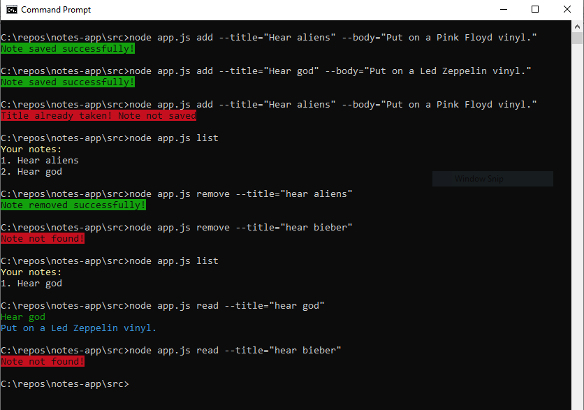

# Notes App

A simple command line based notes taking app with following features

- Add a note.
- Remove a note.
- List all notes.
- Read a notes.

Uses JSON file storage for storing notes.

Uses [chalk](https://www.npmjs.com/package/chalk) for pretty outputs and [yargs](https://www.npmjs.com/package/yargs) for parsing command line arguments.

## Usage

